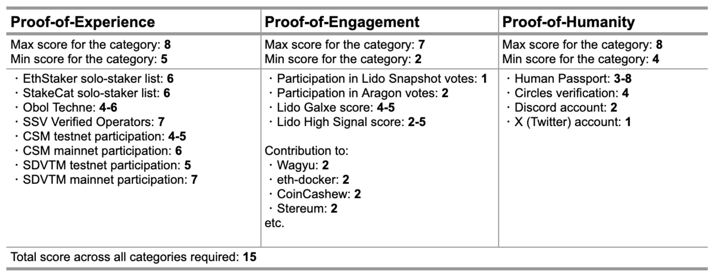

# ICS Assessment Scripts

Lightweight Python utilities for assessing ICS eligibility across three categories:

- Engagement
- Experience
- Humanity

The methodology, scoring, and source rationale are described in the corresponding [Research Forum post](https://research.lido.fi/t/community-staking-module/5917/141).



## Requirements

- Python 3.10+
- `requests`
- `web3`
- `python-dotenv`

Install:

```bash
python -m venv venv
. venv/bin/activate
pip install -r requirements.txt
```

## Quick Start

> Run everything from inside `ics_assessment/`.

### 1. Update Config

When the assessment window changes, update [config.py](./config.py) first.

Commonly edited constants:

- cutoff blocks:
  - `MAINNET_CUTOFF_BLOCK`
  - `HOODI_CUTOFF_BLOCK`
  - `ARBITRUM_CUTOFF_BLOCK`
  - `GNOSIS_CUTOFF_BLOCK`
- Snapshot cutoff:
  - `SNAPSHOT_VOTE_TIMESTAMP`
- High Signal window:
  - `HIGH_SIGNAL_START_DATE`
  - `HIGH_SIGNAL_END_DATE`
- mainnet performance inputs:
  - `MAINNET_PERFORMANCE_REPORT_CIDS`

### 2. Sync Artifacts

All env variables can be set in a `.env` file at the root of `ics_assessment/` or exported in the shell before running sync.

```bash
# export RPC URLs before sync
export MAINNET_RPC_URL=...
export HOODI_RPC_URL=...
export ARBITRUM_RPC_URL=...
export MAINNET_ARCHIVE_RPC_URL=...
export HOODI_ARCHIVE_RPC_URL=...

# refresh local artifacts
python main.py sync all
```

One may wish to commit updated artifacts before committing the final assessment results.

### 3. Run Assessments

```bash
python main.py assess 0xabc... 0xdef...
```

or legacy version

```bash
python main.py 0xabc... 0xdef...
```

The assessment reads local synced artifacts plus the remaining live lookups for:

- High Signal
- Human Passport

```bash
export HIGH_SIGNAL_API_KEY=...
export HUMAN_PASSPORT_API_KEY=...
```

If API keys are not set, those values are entered manually.

The configurable EVM RPC values in [config.py](./config.py) are read from environment variables. Export the RPC environment variables before running sync.

## Commands

### Assess

```bash
python main.py assess 0xabc... 0xdef...
```

or legacy version

```bash
python main.py 0xabc... 0xdef...
```

### Sync

Examples:

```bash
# Sync all sources
python main.py sync all

# Sync selective sources
python main.py sync snapshot galxe gitpoap

# Sync with a custom chunk size
python main.py sync --chunk-size 50000 aragon
```

Supported sync targets:

- `all`
- `aragon`
- `snapshot`
- `galxe`
- `gitpoap`
- `protocol-guild`
- `obol-techne`
- `ssv-verified`
- `node-owners`
- `mainnet-performance`
- `hoodi-eligible`
- `circles`

## Updating Assessment Data

When the assessment window changes, update [config.py](./config.py) first, then resync artifacts.

Commonly edited constants:

- cutoff blocks:
  - `MAINNET_CUTOFF_BLOCK`
  - `HOODI_CUTOFF_BLOCK`
  - `ARBITRUM_CUTOFF_BLOCK`
- Snapshot cutoff:
  - `SNAPSHOT_VOTE_TIMESTAMP`
- High Signal window:
  - `HIGH_SIGNAL_START_DATE`
  - `HIGH_SIGNAL_END_DATE`
- mainnet performance inputs:
  - `MAINNET_PERFORMANCE_REPORT_CIDS`
  - `REQUIRED_PERFORMANCE_WINDOW_HOODI`

Typical refresh flow:

```bash
cd ics_assessment

# 1. update config.py if the assessment window changed

# 2. set RPCs
export MAINNET_RPC_URL=...
export HOODI_RPC_URL=...
export ARBITRUM_RPC_URL=...
export MAINNET_ARCHIVE_RPC_URL=...
export HOODI_ARCHIVE_RPC_URL=...

# 3. refresh local artifacts
python main.py sync all
```

Selective refresh examples:

```bash
python main.py sync aragon
python main.py sync snapshot
python main.py sync node-owners
python main.py sync mainnet-performance
python main.py sync hoodi-eligible
```

Important sync outputs:

- `node-owners` writes:
  - `experience/data/node_operator_owners_mainnet.json`
  - `experience/data/node_operator_owners_hoodi.json`
- `mainnet-performance` writes:
  - `experience/data/eligible_node_operators_mainnet.json`
- `hoodi-eligible` writes:
  - `experience/data/eligible_node_operators_hoodi.json`

The assessment now reads compact eligible-node artifacts for both mainnet and Hoodi CSM checks. Raw mainnet performance report JSON files are not needed at runtime.

### Batch assessment

Make sure that the assessment data is up to date by syncing the relevant sources, then run:

```bash
cd ics_assessment
export HIGH_SIGNAL_API_KEY=...
export HUMAN_PASSPORT_API_KEY=...
python main.py batch
```

To run full batch processing on all applications (including REJECTED and REVIEW), add the `--full` flag:

```bash
python main.py batch --full
```

`batch` reads a fixed CSV input path: `ics_assessment/ics-forms.csv`.

The expected CSV shape matches the export format from the ICS application form:
[csm.lido.fi/type/ics-apply](https://csm.lido.fi/type/ics-apply)

You can start from the template at [ics-forms.template.csv](./ics-forms.template.csv) and place the exported file at `ics_assessment/ics-forms.csv`.

Batch paths are configured in [config.py](./config.py):

- `BATCH_FORMS_PATH`
- `BATCH_LOGS_DIR`
- `BATCH_MAIN_ADDRESS_SUMMARY_PATH`

Expected columns used by the batch processor:

- `id`
- `mainAddress`
- `additionalAddresses`
- `status`
- `twitterLink`
- `discordLink`
- `twitterLinkComment`
- `discordLinkComment`

Example console output:

```text
[#62] APPROVED | main 0x23fb…aa76 | addrs 1 | EXP 6, HUM 8, ENG 7 | total 21 | eligible YES | log logs/62.log
```

## RPC Guidance

Environment variables used by sync:

- common RPCs:
  - `MAINNET_RPC_URL`
  - `HOODI_RPC_URL`
  - `ARBITRUM_RPC_URL`
- archive RPCs for historical node-owner state:
  - `MAINNET_ARCHIVE_RPC_URL`
  - `HOODI_ARCHIVE_RPC_URL`
  - if unset, they fall back to `MAINNET_RPC_URL` and `HOODI_RPC_URL`

Operational note:

- Infura has worked better for the common RPCs because it is less restrictive on large event/log fetch ranges.
- Alchemy has worked better for archive RPCs used by historical node-owner state reads.
- If sync exits before starting a target, export the required RPC env vars above and retry.

## Data Layout

Prepared artifacts live under:

- `ics_assessment/engagement/data/`
- `ics_assessment/experience/data/`
- `ics_assessment/humanity/data/`

Static imported experience inputs live under:

- `ics_assessment/experience/static/`

## Data Sources

Static curated snapshots:

- Experience community lists:
  - [EthStaker](https://github.com/ethstaker/solo-stakers/blob/main/solos_list/solo_stakers_v2.csv)
  - [StakeCat](https://github.com/Stake-Cat/Solo-Stakers/tree/main) ([Solo-Stakers-B.csv](https://github.com/Stake-Cat/Solo-Stakers/blob/main/Solo-Stakers/Solo-Stakers-B.csv), [Rocketpool-Solo-Stakers.csv](https://github.com/Stake-Cat/Solo-Stakers/blob/main/Solo-Stakers/Rocketpool-Solo-Stakers.csv), [Gnosischain-Solo-Stakers.csv](https://github.com/Stake-Cat/Solo-Stakers/blob/main/Gnosischain/Gnosischain-Solo-Stakers.csv))
- SSV verified operators
- SDVTM participants
- Holesky eligible addresses

On-chain synced artifacts:

- Aragon voters
- Snapshot voters
- Galxe loyalty points
- GitPOAP holders
- Protocol Guild holders
- Obol Techne holders
- Circles members
- CSM good performing operator lists

Live at runtime:

- High Signal, if `HIGH_SIGNAL_API_KEY` is set
- Human Passport, if `HUMAN_PASSPORT_API_KEY` is set

## Environment Variables

- `HIGH_SIGNAL_API_KEY`
- `HUMAN_PASSPORT_API_KEY`
- `MAINNET_RPC_URL`
- `HOODI_RPC_URL`
- `ARBITRUM_RPC_URL`
- `MAINNET_ARCHIVE_RPC_URL`
- `HOODI_ARCHIVE_RPC_URL`
- `ICS_SYNC_CHUNK_SIZE`
  - optional default chunk size for sync log fetching

## Tests

```bash
pytest ics_assessment/tests
```

The suite includes:

- unit-style tests
- flow tests
- static prepared-data tests
